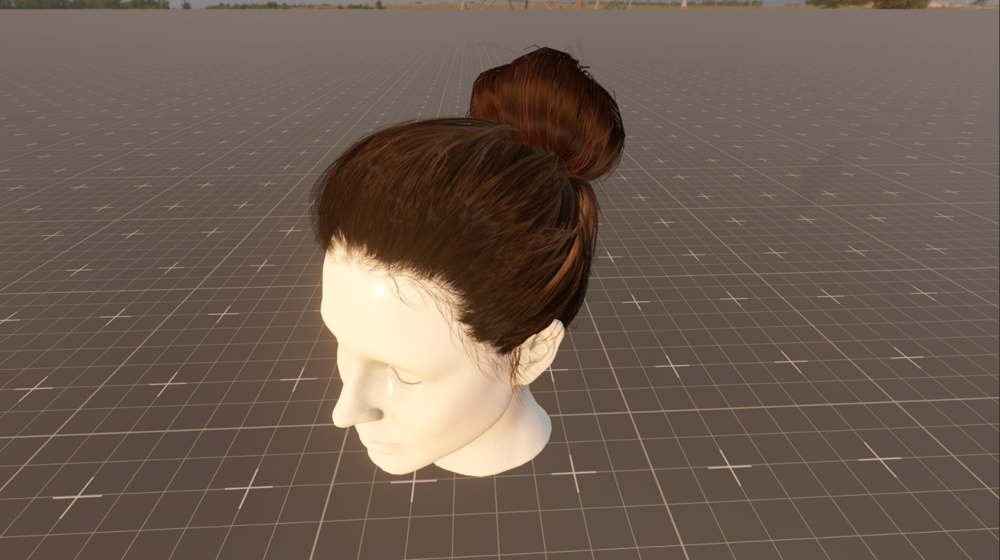
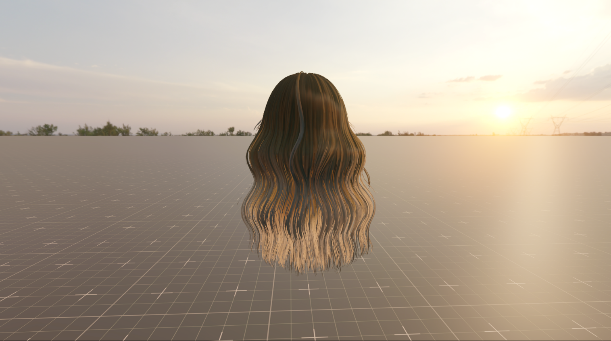

# Hair Rendering in Unity - Kajiya-Kay Shader

A hair rendering shader for Unity's Universal Render Pipeline (URP), implementing an modified version of  Kajiya-Kay lighting model with modern enhancements for realistic hair rendering.


## ⚠️ **WORK IN PROGRESS - NOT PRODUCTION READY**

> **Important Notice:** This shader is currently in active development and is **not ready for production use**. While the core Kajiya-Kay implementation is functional, significant work is still required to achieve high-quality rendering results suitable for commercial projects.

### Current Limitations:
-  **Requires Fine-tuning**: Parameter ranges and default values need optimization
-  **Visual Polish Needed**: Some rendering artifacts may be present under certain lighting conditions
-  **Documentation Incomplete**: Best practices and usage guidelines are still being developed
-  **Testing Required**: Limited testing across different hair types and scenarios
-  **Performance Optimization**: Further optimization needed for mobile and lower-end platforms

### What's Working:
- ✅ Basic Kajiya-Kay anisotropic shading
- ✅ Dual specular highlights (primary and secondary)
- ✅ Root-to-tip color gradients
- ✅ Multiple alpha modes and transparency handling
- ✅ Shader variants and compilation

**Use this shader for experimentation, learning, and development purposes. Contributions and feedback are welcome to help improve the shader towards production quality!**

## 📸 Screenshots

### Hair Shader Demo

*Realistic hair rendering with Kajiya-Kay lighting model showing natural strand separation and anisotropic highlights*

### Additional Hair Showcase

*Demonstration of the shader's color gradients and lighting behavior*

## 🌟 Features

### **Core Lighting Model**
- **Kajiya-Kay Anisotropic Shading**:Hair lighting with dual specular highlights
- **Physically-Based Rendering**: Proper energy conservation and light interaction
- **Transmission/Subsurface Scattering**: Realistic light penetration through hair strands
- **Fresnel Reflectance**: Accurate reflection behavior based on viewing angle

### **Hair-Specific Enhancements**
- **Dual Specular Highlights**: Primary and secondary anisotropic reflections with independent control
- **Strand Separation**: Procedural strand definition using UV-based noise patterns
- **Root-to-Tip Color Gradients**: Smooth color transitions along hair length
- **Per-Strand Hue Variation**: Both clean and noise-based color variation for natural hair diversity

### **Advanced Material Features**
- **Multiple Alpha Modes**: Clip, Clip with Alpha, and pure Alpha blending
- **Smooth Temporal Dithering**: Reduces aliasing in alpha-clipped hair
- **Card Normal Support**: Automatic tangent calculation for hair cards
- **Physical vs Manual Color Modes**: Choose between physically accurate or artistic color control

### **Performance & Compatibility**
- **Shader Variants**: Compile-time optimization with no runtime branching
- **SRP Batcher Compatible**: Optimized for Unity's Scriptable Render Pipeline batching
- **DOTS Instancing Support**: Full support for Unity's Data-Oriented Technology Stack
- **Directional Lights-Only**: The shader only supports Directional lights for now

## 🚀 Quick Start

### Requirements
- **Unity 6.1** or newer
- **Universal Render Pipeline (URP)** 17.1.0 or newer
- **Shader Model 3.5** support

### Installation
1. Clone or download this repository
2. Import the shader files into your Unity project under `Assets/Shaders/Hair/`
3. Create a new Material and assign the **"North Projekt/Hair (Kajiya Kay)"** shader

### Basic Setup
1. **Base Texture**: Assign your hair albedo texture with alpha channel
2. **Color Gradient**: Set root, length, and tip colors for natural hair variation
3. **Specular Settings**: Adjust primary and secondary highlights for your hair type
4. **Alpha Mode**: Choose the appropriate transparency mode for your hair cards

## 📖 Documentation

### **Material Properties**

#### **Surface Inputs**
| Property | Description | Range |
|----------|-------------|-------|
| Base Map | Hair albedo texture (RGB) + Alpha (A) | Texture2D |
| Base Color | Albedo tint color | Color |
| Normal Map | Hair surface normal map | Texture2D |
| Normal Scale | Normal map intensity | 0.0 - 2.0 |
| Occlusion Map | Ambient occlusion (Green channel) | Texture2D |
| Noise Texture | Optional noise for strand variation | Texture2D |

#### **Color Gradient**
| Property | Description | Range |
|----------|-------------|-------|
| Root Color | Color at hair roots | Color |
| Length Color | Color along hair shaft | Color |
| Tip Color | Color at hair tips | Color |
| Root/Tip Distance | Gradient transition points | 0.0 - 1.0 |
| Root/Tip Fade | Gradient softness | 0.01 - 1.0 |

#### **Anisotropic Specular**
| Property | Description | Range |
|----------|-------------|-------|
| Use Physical Colors | Enable physically-based specular colors | Toggle |
| Primary Strength | Main highlight intensity | 0.0 - 1.0 |
| Primary Power | Main highlight sharpness | 1 - 1000 |
| Primary Shift | Main highlight position offset | -1.0 - 1.0 |
| Secondary Strength | Secondary highlight intensity | 0.0 - 1.0 |
| Secondary Power | Secondary highlight sharpness | 1 - 1000 |
| Secondary Shift | Secondary highlight position offset | -1.0 - 1.0 |

#### **Advanced Controls**
| Property | Description | Range |
|----------|-------------|-------|
| Strand Separation | Individual strand visibility | 0.0 - 1.0 |
| Specular Focus | Highlight directional focus | 0.1 - 2.0 |
| Shadow Contrast | Depth and shadow definition | 1.0 - 3.0 |
| Transmission Strength | Subsurface scattering intensity | 0.0 - 5.0 |
| Use Card Normals | Auto-detect hair card orientation | Toggle |

### **Shader Variants**

The shader automatically generates optimized variants based on enabled features:

- `_NORMALMAP`: Normal mapping support
- `_OCCLUSIONMAP`: Ambient occlusion support  
- `_NOISETEXTURE_ON`: Noise-based strand variation
- `_USE_CARD_NORMALS_ON`: Automatic card normal detection
- `_USE_PHYSICAL_SPECULAR_COLORS`: Physical vs manual color modes
- `_ALPHAMODE_CLIP/CLIPWITHALPHA/ALPHA`: Alpha handling modes
- `_SMOOTH_DITHER_ON`: Temporal dithering for alpha clipping

### **Best Practices**

#### **Hair Card Setup**
1. **UV Layout**: Ensure hair flows from root (V=1) to tip (V=0) (we use 1 - v to invert)
2. **Tangent Space**: Hair cards should have consistent tangent directions
3. **Alpha Channel**: Use gradual alpha falloff for natural strand edges
4. **Texture Resolution**: 512x512 to 1024x2048 depending on hair density


#### **Visual Quality**
1. **Dual Highlights**: Set primary highlight sharper than secondary
2. **Color Variation**: Use subtle hue variation (0.01-0.05) for realism
3. **Transmission**: Keep transmission strength moderate (0.5-2.0)
4. **Normal Maps**: Use subtle normal maps to avoid over-detailing

## 🔧 Technical Details

### **Kajiya-Kay Implementation**
The shader implements the Kajiya-Kay lighting model with the following formula:

```hlsl
// Anisotropic specular calculation
sinTH = sqrt(1.0 - (T·H)²)
specular = (sinTH)^power * directionalAttenuation
```

Where:
- `T` = Hair tangent direction
- `H` = Half vector between light and view directions
- `power` = Specular power/sharpness
- `directionalAttenuation` = Focus control for highlight direction

### **Energy Conservation**
The shader implements proper energy conservation:

```hlsl
specularLuminance = dot(totalSpecular, luminanceWeights)
diffuse *= saturate(1.0 - specularLuminance)
```

This ensures that specular highlights don't add unrealistic brightness to the material.

### **File Structure**
```
Hair/
├── HairLit.shader              # Main shader file with pass definitions
├── HairForwardPass.hlsl        # Forward rendering pass implementation  
├── HairInput.hlsl              # Material properties and DOTS support
└── Editor/
    └── HairShaderGUI.cs        # Custom material inspector
```

## 🎨 Examples & Tips

### **Stylized Effects**
- **Fantasy Colors**: Increase hue variation for magical/anime styles
- **Wet Hair**: Increase smoothness and reduce secondary specular
- **Damaged Hair**: Add noise texture and increase strand separation

## 🤝 Contributing

We welcome contributions! Please feel free to:

1. **Report Issues**: Use the GitHub issue tracker for bugs and feature requests
2. **Submit Pull Requests**: Follow the existing code style and include tests
3. **Share Examples**: Show off your hair creations in the discussions
4. **Improve Documentation**: Help us make the documentation clearer

### **Development Setup**
1. Fork the repository
2. Create a feature branch: `git checkout -b feature/my-feature`
3. Test your changes with different hair types and lighting conditions
4. Submit a pull request with detailed description

## 📝 License

This project is licensed under the MIT License - see the [LICENSE](LICENSE) file for details.

## 🙏 Acknowledgments

- **Kajiya and Kay (1989)**: Original hair lighting model research
- **Unity Technologies**: Universal Render Pipeline framework

## 📚 References

- [Kajiya, James T., and Timothy L. Kay. "Rendering fur with three dimensional textures." ACM SIGGRAPH Computer Graphics 23.3 (1989): 271-280.](https://www.cs.drexel.edu/~deb39/Classes/Papers/p271-kajiya.pdf)
- [Unity URP Documentation](https://docs.unity3d.com/Packages/com.unity.render-pipelines.universal@latest)


---

**Made with ❤️ by North Projekt**

*If you find this shader useful, please consider starring the repository and sharing it with the Unity community!*
